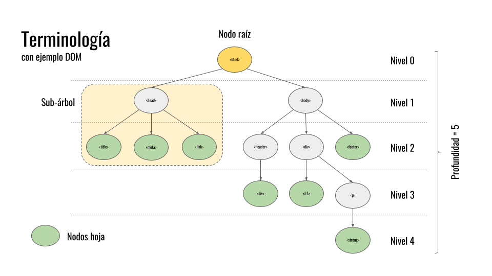

# Estructuras de datos en JavaScript

## Pila

### Teoría

### Código

## Cola

### Teoría

### Código

## Lista ligada

### Teoría

### Código

## Árbol

Los árboles (trees) son una estructura de datos muy común, que se define de forma recursiva como una colección de nodos, empezando por un nodo raíz, donde cada nodo es una estructura de datos que contiene un valor, y opcionalmente una lista de referencias a otros nodos (sus hijos), con la limitación de que ninguna referencia esté duplicada, y que ninguna apunte al nodo raíz.

  ## Termimología de un arbol 

   ### Nodo
El “nodo” es la estructura básica que usamos para construir un “árbol”. Todos los elementos de un árbol son nodos. A su vez, cada nodo es un sub-árbol. Los nodos se caracterizan por tener un valor, y referencias a otros nodos.

   ### Padres / Hijos
Los “hijos” de un nodo son los nodos a los cuáles éste hace referencia. Por ejemplo, en un documento HTML las etiquetas (nodos) <head> y <body> son hijos de el nodo <html>. Al mismo tiempo, diríamos que <html> es el nodo “padre” de tanto <head> como <body>.

   ### Nodo raíz
Todo árbol tiene un nodo inicial o nodo raíz, el cual va a ser el único nodo que no tenga un “padre”.

   ### Nodo hoja
Los nodos hoja son aquellos que no tienen hijos (las hojas del árbol).

   ### Nivel
En un árbol, cuando hablamos de “nivel” nos referimos a la distancia, o el número de saltos que debemos dar hasta llegar al nodo raíz. Podemos verlo también como el “nivel de anidación”.

   ### Altura o profundidad
La altura o profundidad de un árbol hace referencia al nivel máximo que vamos a encontrar.

   ### Orden o grado
El orden o grado de un árbol determina cuántos hijos puede tener un nodo. Por ejemplo, un árbol de orden 2 sería un árbol binario, donde cada nodo puede tener como máximo dos hijos. Un árbol de orden 3 o ternario permitiría que cada nodo tenga un máximo de tres hijos. Un árbol no está obligado a determinar un orden o grado.



### Tipos de arboles 

   ### Árbol completo
Un árbol completo es aquel en el que todos los nodos tienen o ningún hijo o el número máximo de hijos.

   ### Árbol degenerado
Cuando un árbol contiene 1 sólo hijo por nodo. Los árboles degenerados tienen la profundidad máxima posible dado un número de elementos. Este tipo de árboles se comportan como listas.

   ### Árbol balanceado
Lo opuesto a un árbol degenerado sería un árbol balanceado, donde el árbol tiene la profundidad mínima posible dado un número de elementos.


### Código
  ```
 class Node {
  constructor (value) {
    this.value = value
    this.right = null
    this.left = null
  }
}

class Tree {
  constructor () {
    this.root = null
  }

  isEmpty () {
    return this.root === null
  } // Si el arbol esta vacio regresar nulo 

  add (value) {
    // arbol no tiene elementos
    if (this.isEmpty()) {
      this.root = new Node(value)
      return
    }

    var aux = this.root

    while (aux) {
      // vamos hacia la izquierda
      if (value < aux.value) {
        if (aux.left) {
          aux = aux.left
        } else {
          aux.left = new Node(value)
          return
        }
      } else { // vamos hacia la derecha
        if (aux.right) {
          aux = aux.right
        } else {
          aux.right = new Node(value)
          return
        }
      }
    }
  }

   addRecursive (value, node = this.root) {
    if (!node) {
      this.root = new Node(value)
      return
    } //Crea un nuevo9 nodo con el valor 

    if (value < node.value) {
      if (node.left) {
        return this.addRecursive(value, node.left)
      } // si el valor del nodo es menor al valor izquierdo de referencia, entonces agregamos el nodo en el lado izquierdo 
      node.left = new Node(value)
      return
    } else { // en caso contrario  vamos hacia la derecha y agregamos el nodo 
      if (node.right) {
        return this.addRecursive(value, node.right)
      } 
      node.right = new Node(value)
      return
    }
  }
  
```
## Grafo

### Teoría

### Código

## Arreglo

### Teoría

### Código


## Referencias 

[Código de un árbol binario en javascript](https://gist.github.com/rodrwan/b1d01a8f2a6eb3808824eabae6ff5226 "Arbol binario en js")


[Árboles en js](https://medium.com/laboratoria-how-to/%C3%A1rboles-trees-51783ba4ebe5 "Arbol en js")

[Explicación de arbol en Java Script]( "Explicación de estructura de árbol en JavaScript")

[Explicación de los arboles en Javascript](https://www.youtube.com/watch?v=Qexq1k8LB6k&index=11&list=PLTd5ehIj0goMTSK7RRAPBF4wP-Nj5DRvT"Explicación de los arboles en Javascript")

[Explicación de arbol binario parte 1]( https://www.youtube.com/watch?v=OVCNzj5BMcs&index=12&list=PLTd5ehIj0goMTSK7RRAPBF4wP-Nj5DRvT "Explicación de un árbol binario parte 1")

[Explicación de arbol binario parte 2]( https://www.youtube.com/watch?v=G1VS5FbtMS4&index=13&list=PLTd5ehIj0goMTSK7RRAPBF4wP-Nj5DRvT "Explicación de un árbol binario parte 2")

[Explicación de arbol binario parte 3]( https://www.youtube.com/watch?v=i77HKoFWyyI&list=PLTd5ehIj0goMTSK7RRAPBF4wP-Nj5DRvT&index=16 "Explicación de un árbol binario parte 3")

[Explicación de un arbol binario](http://www.utm.mx/~rruiz/cursos/ED/material/ABB.pdf "Arboles binarios ")